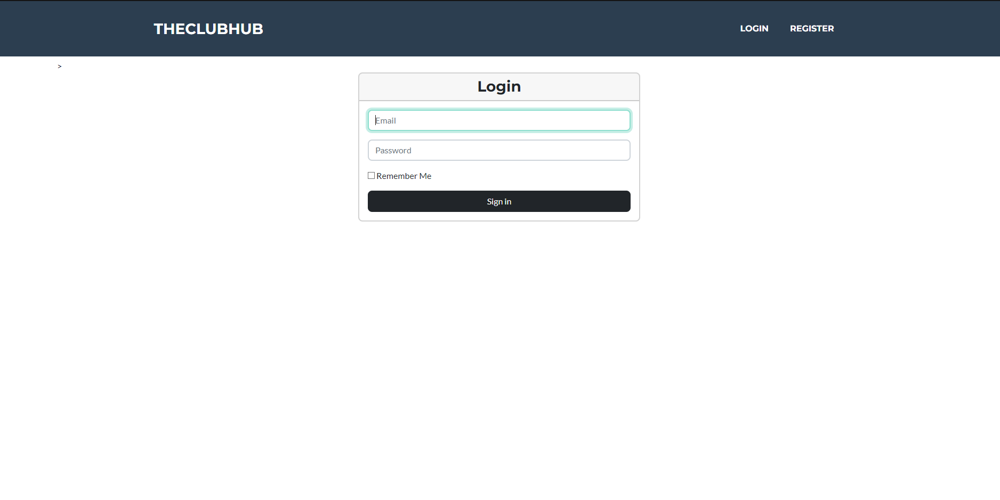
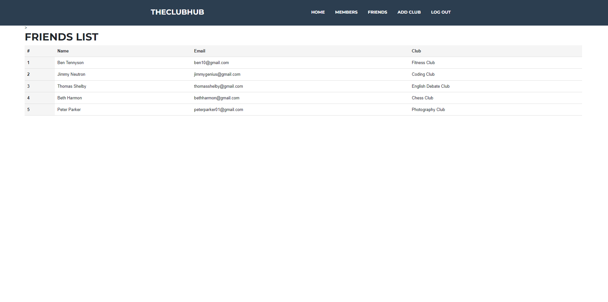

# INFO 3305 GROUP PROJECT (GROUP 1)

NAME | MATRIC NO
------------- | -------------
NASYA FIRZANA BINTI MOHAMAD SOLLEH  | 1917642
ERIN SURAYA RAHMAN | 2114128
KHAIRUL NAJMI BIN KHAIRUL AZAM | 2016671
MOHAMAD HAZIM BIN MAHMUD | 2121265
KAMARUL NAIM BIN RAZALI| 2121179

# PROJECT TITLE

# **CLUB REGISTRATION SYSTEM** 

## INTRODUCTION

A club registration system is a centralized platform where students gets to choose and register their desired clubs/societies.

The implementation of a web-based application specifically designed for club registration is essential in order to accelerate and modernize the procedure of enrolling in organizations or clubs. 

By offering a centralized platform that is convenient and easily accessible to a broad audience, it facilitates registration in a streamlined manner from any location with internet connectivity. This application obviates the necessity for exhausting documentation, enabling users to efficiently browse, enroll to, and monitor club memberships.

## OBJECTIVES

1. To develop a user-friendly club registration website application that allows individuals to easily register and join various clubs or organizations.
2. To create a streamlined registration process that collects necessary information from users, such as personal details and club preferences, ensuring accurate and efficient club enrollment.
3. To enable club administrators to manage and track club registrations, including the ability to view and export membership data, send notifications, and communicate with registered members.
4. To enhance the user experience by providing a comprehensive club directory, allowing users to search and explore different clubs based on their interests, location, or other relevant criteria.
## Features

*1. Landing Page:*
   - Welcome message and overview of the club.
   - Clear call-to-action buttons for new users to register or existing members to log in.
   - Highlight key features such as customized profiles, event notifications, and communication channels.

*2. User page:*
   - New users fill out a registration form with essential information.
   - Email verification for account activation.
   - Returning users log in using their credentials or social media accounts.
   - Option to create a customized profile with personal details, interests, and a profile picture.
   

*3. Dashboard:*
   - Personalized dashboard displaying user's profile, current memberships, upcoming events, and notifications.
   - Quick links to key features like profile customization and membership management.

*4. Browse Clubs:*
   - Search and filter options for users to discover clubs based on interests, categories, or keywords.
   - Detailed club profiles with descriptions, images, and upcoming events.
   - Users can enroll in clubs directly from the browse club page.

*5. Events:*
   - Calendar view displaying upcoming events for all clubs or specific clubs a user is a member of.
   - Option to RSVP or register for events directly from the calendar.

*6. Notifications:*
   - Real-time notifications for new event announcements, club updates, or important announcements.
   - Users can customize notification preferences.

*7. Communication Channels:*
   - Integrated messaging or discussion forums for members to communicate and connect.
   - Clubs may have their own communication channels for internal discussions.

## ERD DIAGRAM

## SEQUENCE DIAGRAM

## FINAL PRODUCT SYSTEM 

Register/login Page

Club Description Page

Club Page

Join Club Page

Communication Page

Notifications Page

## Challenges/difficulties to develop the application
*1. Creating multiple routing and controller*

*2. Developing multiple views that function respectively*

*3. Error and Exception Handling*